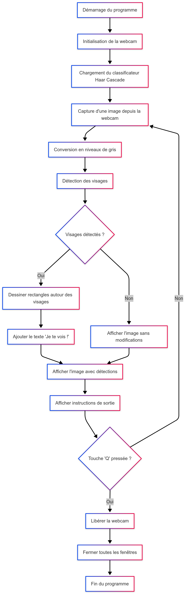

# OpenCV Face Detector Project

Un détecteur de visages en temps réel développé en Python utilisant OpenCV et les classificateurs Haar Cascade.

## Fonctionnalités

- **Détection en temps réel** : Analyse les visages via la webcam
- **Interface visuelle** : Dessine un rectangle rouge autour des visages détectés
- **Messages personnalisés** : Affiche "Je te vois !" lors de la détection
- **Contrôle simple** : Appuyez sur 'Q' pour quitter l'application

## Installation

### Prérequis
- Python 3.7 ou plus récent
- Webcam fonctionnelle

### Dépendances
```bash
pip install opencv-python
```

### Fichiers requis
Assurez-vous que le fichier `haarcascade_frontalface_default.xml` est présent dans le répertoire du projet. Ce fichier est généralement inclus avec OpenCV.

## Utilisation

1. **Cloner ou télécharger le projet**
2. **Installer les dépendances** (voir section Installation)
3. **Exécuter le script** :
   ```bash
   python main.py
   ```
4. **Utiliser l'application** :
   - Placez-vous devant la webcam
   - Les visages détectés seront encadrés en rouge
   - Appuyez sur 'Q' pour quitter

## Diagramme de flux



## Structure du code

### Fonctions principales

- `detect_faces(frame, cascade)` : Détecte les visages dans une image
- `draw_faces(frame, faces)` : Dessine les rectangles et textes sur les visages détectés
- `main()`: Fonction principale gérant la boucle de capture et d'affichage

### Paramètres de détection

- `scaleFactor=2` : Facteur de réduction de l'image à chaque échelle
- `minNeighbors=4` : Nombre minimum de voisins requis pour chaque rectangle candidat

## Spécifications techniques

- **Langage** : Python 3.7+
- **Bibliothèques** : OpenCV
- **Algorithme** : Haar Cascade Classifier
- **Format d'entrée** : Flux vidéo en temps réel (webcam)
- **Format de sortie** : Affichage vidéo avec annotations

## Dépannage

**Problème** : La webcam ne s'active pas
- Vérifiez que la webcam est connectée et fonctionnelle
- Essayez de changer l'index de la caméra : `cv2.VideoCapture(1)` au lieu de `cv2.VideoCapture(0)`

**Problème** : Fichier `haarcascade_frontalface_default.xml` introuvable
- Téléchargez le fichier depuis le repository officiel d'OpenCV
- Vérifiez que le fichier est dans le même répertoire que le script

**Problème** : Détection peu précise
- Ajustez les paramètres `scaleFactor` et `minNeighbors`
- Assurez-vous d'avoir un bon éclairage